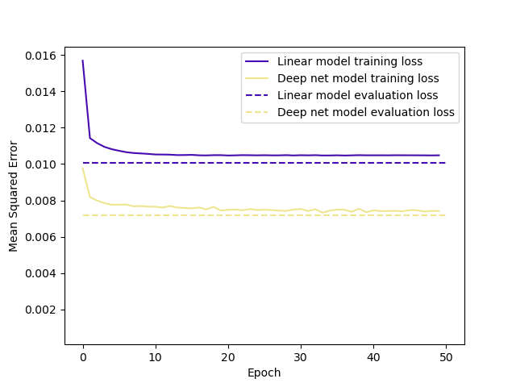

# Household power consumption
This is a project that predicts reactive power based on certain features in household power consumption.

## Description
In this project, we create a linear and deep net model for predicting reactive power consumption. In total, there are eight features used for prediction, whereas the rows with missing values are dropped. The list of hyper parameters includes learning_rate=0.01, batch_size=5000, train_size=0.8, epochs=50, dropout_rate=0.05 and l2_regularization=0.001.

## Data set
The [dataset contains](https://data.world/databeats/household-power-consumption) 260,640 measurements of the household electricity consumption, and it consists of the following nine attributes:
1. Date
2. Time
3. Global active power (in kilowatt)
4. Global reactive power (in kilowatt)
5. Voltage (in volt)
6. Global intensity (in ampere)
7. Sub metering 1 (in watt-hour of active energy)
8. Sub metering 2 (in watt-hour of active energy)
9. Sub metering 3 (in watt-hour of active energy)

In addition, we compose the following bucketized features columns:
1. 'Time' feature in 24 backets
2. 'Week' feature in 52 backets

## Resulsts
As presented in the figure, the computation results show that the evaluation loss for the linear and deep net models are 0.01 and 0.007, respectively.

